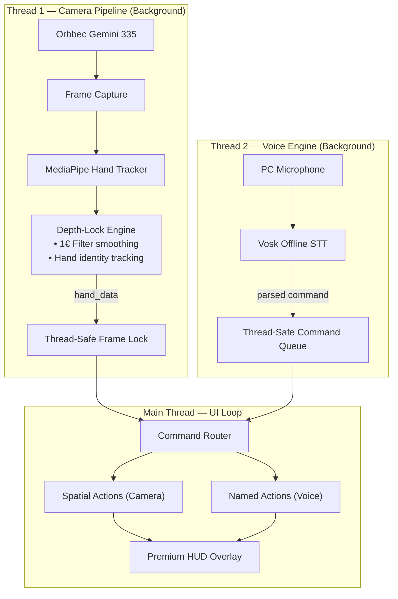

# Aether-Link: Complete System Reference

> **Hardware:** Orbbec Gemini 335 3D Depth Camera + PC Microphone
> **Software:** MediaPipe + Vosk (Offline STT) + PyQt6
> **Architecture:** Hybrid Gesture + Surgical Voice

---

## 🏗️ System Architecture



---

## 🌟 The Golden Rule
To ensure maximum reliability and comfort, Aether-Link splits tasks between two systems:

1. **Gemini 335 Camera (Spatial):** Handles **Continuous** actions like pointing, scrolling, and drawing. Only a 3D sensor can provide real-time spatial positioning.
2. **Vosk Voice (Named):** Handles **Discrete** actions like clicking, typing, and switching modes. One word is faster than a gesture for binary operations.

---

## 🎯 Every Function: Camera vs. Voice

### 🖐️ Handled by Gemini 335 (Camera)
| Function | Mode | Why Camera? |
|----------|------|-------------|
| **Cursor Movement** | Mouse | Real-time 30fps spatial tracking is the only way to point. |
| **Scrolling** | All | Swiping encodes direction AND speed naturally. |
| **Dwell-Click** | All | Zero-effort confirmation when your hand is already pointing. |
| **Play/Pause** | Media | Hand gesture (Open Palm) is intuitive for "Stop". |
| **3D Signature** | Locked | **Biometric Security:** Tracking a unique 3D path in air. |

### 🎙️ Handled by Vosk (Voice)
| Function | Voice Command | Why Voice? |
|----------|---------------|------------|
| **Text Input** | `"type [text]"` | Types instantly. Air-keyboard is 30x slower. |
| **Click Confirmation** | `"click"` | Air-push causes cursor jitter; voice keeps it perfectly still. |
| **Mode Switching** | `"go to mouse"` | Instant jump. Skips multiple sequential swipes/menu steps. |
| **Window Mgmt** | `"minimize window"` | Discrete named actions are faster than specific gestures. |

---

## ⚡ High-Performance Features

### 1. Z-Adaptive Cursor Gain (C-D Gain)
The cursor speed dynamically scales based on your distance from the camera:
* **Close (30cm):** Precise control for small targets.
* **Far (1.5m+):** High-speed navigation. A small wrist flick covers the whole screen.
* **Math:** `gain = (current_z / 500mm) ^ 0.6` (Capped at 2.5x).

### 2. 1 Euro Filter Smoothing
Replaced standard smoothing with a speed-adaptive filter. 
* **Still:** Maximum jitter removal.
* **Moving:** Zero-lag response.

### 3. Hand Identity Tracking
Prevents the cursor from "teleporting" if someone walks behind you. If the hand position jumps more than 200 pixels in one frame, the system rejects it as a different person.

---

## 📋 Full Command Reference

### Voice Commands (Exact Phrase Only)
| Category | Commands |
|----------|----------|
| **Navigation** | `"go home"`, `"go to mouse"`, `"media mode"`, `"tab mode"`, `"go back"` |
| **Clicking** | `"click"`, `"right click"`, `"double click"` |
| **Media** | `"play music"`, `"pause music"`, `"volume up"`, `"volume down"`, `"next track"` |
| **Window** | `"next window"`, `"minimize window"`, `"maximize window"`, `"task view"` |
| **System** | `"type hello"`, `"take screenshot"`, `"show keyboard"`, `"lock system"`, `"exit app"` |

### Camera Gestures
| Gesture | Action |
|---------|--------|
| **Air-Push** | Click / Select (Push forward 5cm) |
| **Dwell** | Auto-click (Hover 1.5s) |
| **Pinch** | Toggle Keyboard Overlay (Thumb + Index) |
| **Peace Sign** | Screenshot (Index + Middle) |
| **Open Palm** | Play/Pause (In Media Mode) |
| **Swipe** | Directional (Left/Right/Up/Down) |

---

## 🔒 Security Workflow
1. **LOCKED:** System starts locked if a signature exists.
2. **RECORD:** Perform an air-push to start recording your 3D signature.
3. **DRAW:** Move your hand in your unique 3D pattern.
4. **UNLOCK:** The system uses DTW (Dynamic Time Warping) to verify the pattern.
5. **BYPASS:** If you forget your signature, delete `signatures/my_signature.json` while the app is closed.

---

## 🚀 Installation & Running

```powershell
# 1. Install dependencies
pip install -r requirements.txt

# 2. Setup Voice Model (First time only)
python -c "import os; os.makedirs('models', exist_ok=True)"
# Download Vosk English model into models/vosk-model-small-en-us-0.15

# 3. Run
python main.py
```
