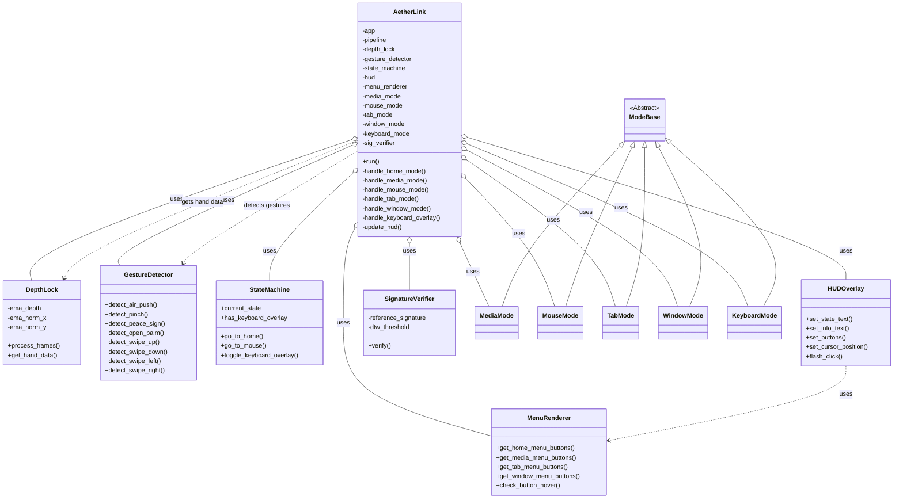
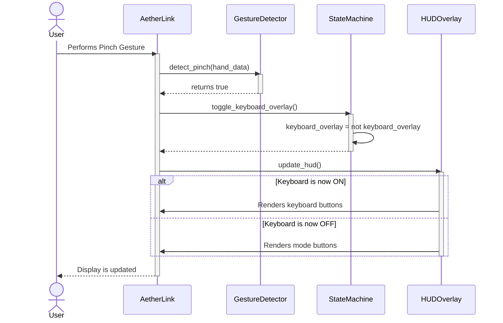
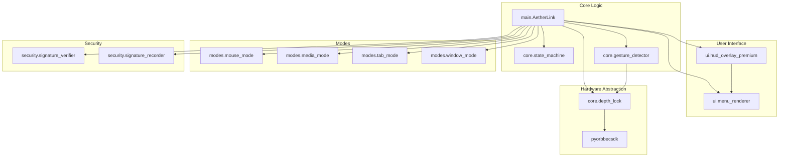

# Aether-Link UML Diagrams (Mermaid)

This file contains all major UML diagrams for the Aether-Link project, written in Mermaid syntax.

---

## 1. Class Diagram

This diagram shows the main classes and their relationships, giving a complete overview of the system architecture.



---

## 2. Use Case Diagram

This diagram shows the actions (use cases) available to the end-user.

```mermaid
flowchart TD
    subgraph Aether-Link System
        uc1(Control Mouse Cursor)
        uc2(Perform Left Click)
        uc3(Switch Modes)
        uc4(Control Media Playback)
        uc5(Manage Browser Tabs)
        uc6(Manage App Windows)
        uc7(Toggle Virtual Keyboard)
        uc8(Type on Keyboard)
        uc9(Take Screenshot)
        uc10(Unlock System via Signature)
    end

    User --> uc1
    User --> uc2
    User --> uc3
    User --> uc4
    User --> uc5
    User --> uc6
    User --> uc7
    User --> uc8
    User --> uc9
    User --> uc10

    uc7 -.-> uc8 : <<includes>>
    uc3 -.-> uc1 : <<extends>>
    uc3 -.-> uc4 : <<extends>>
    uc3 -.-> uc5 : <<extends>>
    uc3 -.-> uc6 : <<extends>>
```

---

## 3. Sequence Diagram: Toggling the Keyboard

This diagram shows the sequence of interactions between objects when the user performs a **Pinch gesture** to toggle the keyboard.



---

## 4. Activity Diagram: Main Application Loop

This diagram shows the flow of activities from starting the app to handling user input in different states.

```mermaid
flowchart TD
    A[Start] --> B{Initialize Hardware & UI};
    B --> C{System Locked?};
    C -- Yes --> D[Handle Lock Mode];
    D --> E{Unlock Successful?};
    E -- No --> D;
    C -- No --> F;
    E -- Yes --> F[Enter HOME Mode];
    
    F --> G[Process Camera Frames & Detect Hand];
    G --> H{Hand Detected?};
    H -- No --> G;
    H -- Yes --> I[Detect Gestures (Push, Pinch, Swipe)];
    
    I --> J{Current State?};
    J -- HOME --> K[Handle Home Mode Logic];
    J -- MOUSE --> L[Handle Mouse Mode Logic];
    J -- MEDIA --> M[Handle Media Mode Logic];
    J -- TAB --> N[Handle Tab Mode Logic];
    J -- WINDOW --> O[Handle Window Mode Logic];
    
    subgraph Mode Handlers
        K; L; M; N; O;
    end
    
    K --> P[Update HUD];
    L --> P;
    M --> P;
    N --> P;
    O --> P;
    
    P --> Q{Keyboard Overlay Active?};
    Q -- Yes --> R[Handle Keyboard Input];
    R --> S[Update HUD with Keyboard];
    S --> G
    Q -- No --> G;
```

---

## 5. Component Diagram

This diagram shows the high-level components and their dependencies.


